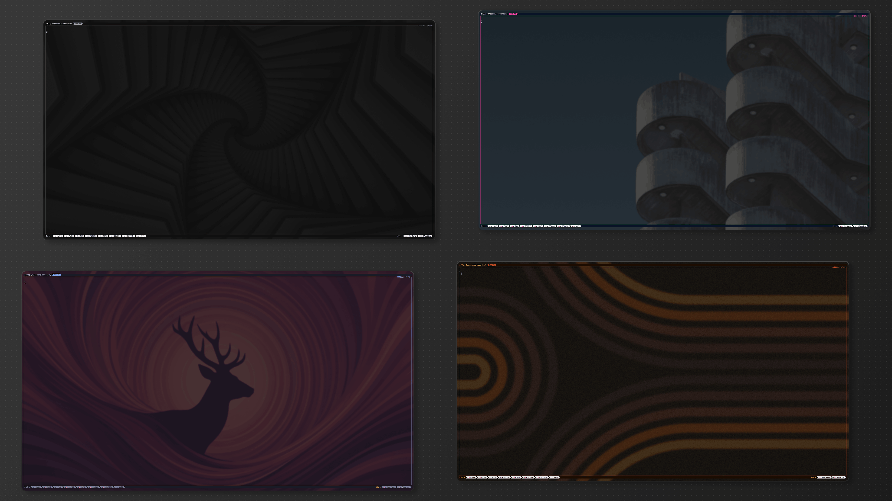

<!-- space between -->
<h1 style="display: flex; align-items: center; gap: 50px;">
  <div>omarchy-zellij-theme</div> 
</h1>

Syncs your [Zellij](https://zellij.dev/) theme with your [Omarchy](https://omarchy.org/) system theme automatically.

<p align="center">
  
</p>

Every time you run `omarchy-theme-set`, Zellij picks up the same color palette in real time.

## How it works

Omarchy's template engine processes `zellij.kdl.tpl` using the active theme's `colors.toml`, generating a KDL theme block. A `theme-set` hook converts the output from comma-separated RGB (`R,G,B`) to space-separated (`R G B`) and injects the `themes {}` block directly into `~/.config/zellij/config.kdl`. Since Zellij watches its config file, existing sessions hot-reload the new theme instantly.

```
colors.toml ──> omarchy-theme-set-templates ──> zellij.kdl (R,G,B)
                                                     │
                                               theme-set hook
                                            (sed R,G,B -> R G B)
                                                     │
                                                     ▼
                                      ~/.config/zellij/config.kdl
                                      (inline themes {} block)
                                                     │
                                                     ▼
                                          Zellij hot-reloads ✓
```

### Color mapping

| Zellij component         | Omarchy color                                            |
| ------------------------ | -------------------------------------------------------- |
| Text base                | `foreground`                                             |
| Backgrounds              | `background`, `color0` (selected)                        |
| Ribbon selected          | `accent` bg, `background` text                           |
| Ribbon unselected        | `color7` bg, `background` text                           |
| Frame selected           | `accent`                                                 |
| Frame unselected         | `color8`                                                 |
| Frame highlight          | `color3`                                                 |
| Emphases                 | `color1`..`color5` distributed across emphasis_0..3      |
| Exit success / error     | `color2` / `color1`                                      |

## Install

```bash
git clone https://github.com/skvggor/omarchy-zellij-theme.git
cd omarchy-zellij-theme
./install.sh
```

The installer:

1. Symlinks `zellij.kdl.tpl` into `~/.config/omarchy/themed/`
2. Installs the `theme-set` hook into `~/.config/omarchy/hooks/`
3. Adds `theme "omarchy"` to `~/.config/zellij/config.kdl` (creates a timestamped backup first)
4. Cleans up old theme file from previous approach if present
5. Generates and injects the current theme inline into `config.kdl`

It is safe to re-run -- the script is idempotent.

If you already have a custom `~/.config/omarchy/hooks/theme-set`, the installer appends the Zellij integration instead of overwriting it.

## Uninstall

```bash
./uninstall.sh
```

This reverts everything:

1. Removes the template symlink from `~/.config/omarchy/themed/`
2. Removes the hook (or just the appended section if you had a pre-existing hook)
3. Comments out `theme "omarchy"` in `~/.config/zellij/config.kdl`
4. Removes the inline `themes {}` block from `config.kdl`
5. Cleans up old theme file if present

Zellij returns to its default theme on the next session.

## Files

| File              | Purpose                                                              |
| ----------------- | -------------------------------------------------------------------- |
| `zellij.kdl.tpl`  | Zellij theme template using `{{ key_rgb }}` placeholders             |
| `theme-set`        | Hook script -- converts RGB format and injects theme into config.kdl |
| `install.sh`       | Installer (symlink, hook, config, initial apply)                     |
| `uninstall.sh`     | Uninstaller (reverts all changes)                                    |

## Requirements

- [Omarchy](https://omarchy.org/) with the template/hook system (`omarchy-theme-set`, `omarchy-theme-set-templates`)
- [Zellij](https://zellij.dev/) with config at `~/.config/zellij/config.kdl`

## Usage

After installing, just use Omarchy as usual:

```bash
omarchy-theme-set tokyo-night   # Zellij theme updates instantly (all sessions)
omarchy-theme-set catppuccin    # same
omarchy-theme-next              # same
```

All Zellij sessions -- including ones already running -- pick up the new theme in real time.
